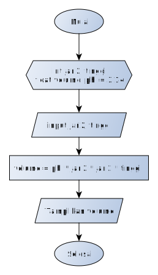

a# Jobsheet 04 - Sintaks, Tipe Data, Variabel, Input-Output, Sequence

### Kompetensi

1. Mahasiswa memahami sintaks dasar bahasa pemrograman Java.
2. Mahasiswa mampu mengimplementasikan tipe data, variabel, Input-Output ke
   dalam program bahasa Java.
3. Mahasiswa memahami konsep alur kontrol sequence pada program.

### Alat dan Bahan

1. PC/Laptop
2. Text Editor (Sublime Text)
3. JDK

### Ulasan Teori

Dalam membuat sebuah program, kita harus mengikuti struktur dasar dari bahasa
pemrograman. Ada beberapa komponen yang hampir selalu muncul setiap kali kita
membuat program. Komponen-komponen tersebut antara lain:

1. Fungsi main()
2. Deklarasi variabel
3. Perintah (statement)
4. Keyword
5. Komentar
6. Kurung kurawal

Berikut adalah contoh kode program beserta penjelasan strukturnya:

```java
// "import" untuk menyertakan fungsi-fungsi dari sebuah library
import java.util.Scanner;

// program harus ditulis dalam sebuah class
class PersegiPanjang { // kurung kurawal buka
  public static void main(String args[]) {
    // deklarasi variabel
    int panjang;
    int lebar;
    int luas;

    // statement
    panjang = 5;
    lebar = 3;
    luas = panjang * lebar;
    System.out.println("Luas persegi panjang: " + luas);
  }
} // kurung kurawal tutup
```

#### Fungsi Utama/Fungsi main()

Agar program java dapat dijalankan, harus terdapat fungsi main(). Program yang
tidak memiliki fungsi ini, maka tidak dapat dijalankan secara langsung. Ketika
fungsi main dipanggil, akan dieksekusi perintah-perintah/statement yang terdapat
dalam blok kodenya. Fungsi main dibuka dengan kurung kurawal buka `{` dan kurung
kurawal tutup `}`. Secara garis besar, isi dari fungsi main() pada program di
atas adalah:
  1. Perintah untuk memberikan nilai panjang dan lebar dengan nilai 5 dan 3.
  2. Perintah untuk menghitung luas segiempat.
  3. Perintah untuk menampilkan luas yang telah dihitung ke layar.

#### Deklarasi Variabel

Variabel adalah tempat untuk menyimpan data. Deklarasi variabel adalah sebuah
perintah agar komputer menyediakan variabel yang akan kita pakai. Pendeklarasian
variabel harus diawali dengan tipe variabel, nama variabel kemudian diakhiri
dengan titik-koma `;`.

Beberapa tipe variabel yang sering digunakan:
  1. Variabel Integer (int) untuk menyimpan bilangan bulat/tanpa koma. Contoh:
     12, 1, 76, 100, 99.
  2. Variabel float (float) untuk menyimpan bilangan berkoma/real. Contoh: 12.8,
     1.5, 3.14.
  3. Variabel Strin untuk menyimpan karakter/kata/kalimat bisa berupa huruf
     ataupun angka. Contoh: "Polinema", "Budi", "Berat badan 60 kg", "Rp.
     500.000"

Dalam memberi nama variabel ada beberapa aturan yang harus dipenuhi, antara
lain:
  - Diawali dengan huruf atau karakter underscore `_`
  - Nama variabel bersifat case sensitive (huruf besar dianggap berbeda dengan
    huruf kecil)
  - Tidak boleh menggunakan spasi (sebagai pengganti dapat digunakan tanda
    underscore atau penggunaan huruf besar pada awal kata berikutnya)
  - Tidak boleh menggunakan karakter khusus seperti `<`,`>`,`*`,`?`,`=` dan
    sebagainya.

Beberapa Keyword yang tidak boleh digunakan sebagai nama variabel:

|          |         |            |              |           |
| -------- | ------- | ---------- | ------------ | --------- |
| abstract | default | if         | private      | this      |
| assert   | do      | implements | protected    | throw     |
| boolean  | double  | import     | public       | throws    |
| break    | else    | instanceof | return       | transient |
| byte     | enum    | int        | short        | try       |
| case     | extends | interface  | static       | void      |
| catch    | final   | long       | strictfp     | volatile  |
| char     | finally | native     | super        | while     |
| class    | float   | new        | switch       |           |
| continue | for     | package    | synchronized |           |

Selengkapnya, tipe-tipe variabel yang sering dipakai dalam pemrograman java ada
di tabel berikut ini:

| Type    | Values                  | Default | Size                         | Range                                       |
| ---     | ---                     | ---     | ---                          | ---                                         |
| byte    | signed integers         | 0       | 8 bits                       | -128 to 127                                 |
| short   | signed integers         | 0       | 16 bits                      | -32768 to 32767                             |
| int     | signed integers         | 0       | 32 bits                      | -2147483648 to 2147483647                   |
| long    | signed integers         | 0       | 64 bits                      | -9223372936854775808 to 9223372936854775807 |
| float   | IEEE 754 floating point | 0.0     | 32 bits                      | approximately ±3.40282347E+38F              |
| double  | IEEE 754 floating point | 0.0     | 64 bits                      | approximately ±1.79769313486231570E+308     |
| char    | Unicode character       | \u0000  | 16 bits                      | \u0000 to \uFFFF                            |
| boolean | true, false             | false   | 1 bit used in 32 bit integer | NA                                          |

Selain harus memperhatikan jenis tipe data yang digunakan, tipe data juga
mempunyai penulisan nilai yang berbeda. Sebagai contoh penulisan nilai tipe data
char harus diapit dengan tanda `'` (petik satu). Variabel String harus
menggunakan tanda `"` (petik dua). Dalam penulisan bilangan pecahan digunakan
tanda `.` (titik) bukan koma. Secara umum, format deklarasi variabel dapat
dinyatakan sebagai berikut:

```
tipe_data nama_variabel;
tipe_data nama_variabel = nilai_awal;
```

**Contoh**:

```java
int bilangan;
float volume, luas;
int angka = 1;
float phi = 3.14f;
char kelas = 'A';
String nama = "Joko Sembung";
```

#### Sequence/Statement

Perintah/statemen digunakan untuk memerintahkan komputer untuk melakukan
sesuatu. Contoh, pada program menghitung luas persegi panjang diatas, ada
beberapa statemen:

1. Perintah `panjang = 10;` memerintahkan komputer untuk mengisi variabel panjang
   dengan nilai 10. Begitu juga dengan perintah `lebar = 5;`

2. Perintah `luas = panjang * lebar;` memerintahkan komputer untuk menghitung
   hasil perkalian dari panjang dan lebar, lalu menyimpannya kedalam variabel
   luas.

3. Perintah `System.out.println("Luas persegi panjang: " + luas);` memerintahkan
   komputer untuk menampilkan isi variabel luas ke layar.

Setiap statement harus diakhir dengan titik koma `;`, kecuali
statement-statement tertentu seperti `if`, `for`, `while`, `class` dan
sebagainya.

#### Keyword import

Digunakan untuk memanggil library/fungsi-fungsi yang telah disediakan oleh
bahasa Java. Perintah `import java.util.Scanner;` digunakan untuk memanggil
library `Scanner` yang diperlukan untuk menerima input dari keyboard yang akan
dibahas di bagian input.

#### Kurung Kurawal

Kurung kurawal berfungsi untuk memberitahu komputer bahwa perintah-perintah di
dalamnya merupakan satu kesatuan. Singkatnya, kurung kurawal digunakan untuk
membuat sekumpulan perintah (compount statement/block).

#### Output

Setiap program pasti menghasilkan output. Salah satu cara untuk menampilkan output adalah dengan
menampilkannya ke layar. Untuk menampilkan ke layar, ada beberapa cara:

1. `System.out.print(“Hello world”);` Perintah ini akan menampilkan kata Hello
   world ke layar, atau apapun yang kita tuliskan didalam tanda petik.

2. `System.out.println(“Hello world”);` Perintah ini akan menampilkan kata Hello
   world ke layar, atau apapun yang kita tuliskan didalam tanda petik, sekaligus
   memberi perintah ganti baris di akhir kata/kalimat.

3. `System.out.println(panjang);` Perintah ini akan menampilkan isi variabel
   panjang ke layar. Perhatikan bahwa untuk menampilkan isi variabel, tidak
   perlu menggunakan tanda petik ( “ ).

4. `System.out.println(“Panjang segi empat: “ + panjang);` Perintah ini akan
   menampilkan kalimat “Panjang segi empat: “ kemudian disambung dengan isi
   variabel panjang ke layar. Perhatikan untuk menyambung kalimat dengan isi
   variabel, digunakan tanda plus ( + ).

**Contoh**:

1. Menggunakan System.out.print()
  ```java
  System.out.print("Hello World!");
  System.out.print("Nama saya Jack");
  ```
  Hasil
  ```
  Hello World!Nama saya Jack
  ```
2. Menggunakan System.out.println()
  ```java
  System.out.println("Hello World!");
  System.out.println("Nama saya Jack");
  ```
  Hasil
  ```
  Hello World!
  Nama saya Jack
  ```
3. Menampilkan isi variabel panjang
  ```java
  int panjang = 10;
  System.out.println(panjang);
  ```
  Hasil
  ```
  10
  ```
4. Menampilkan kalimat "Panjang segi empat" dan disambung dengan isi variabel
   panjang
   ```java
   int panjang = 10;
   System.out.println("Panjang segi empat: " + panjang);
   ```
   Hasil
   ```
   Panjang segi empat: 10
   ```

Pada output program terdapat beberapa karakter khusus. Karakter-karakter ini
dikenal dengan istilah escape sequence. Karakter-karakter yang umum digunakan
dapat dilihat pada tabel berikut ini:

| Escape Sequence | Keterangan         |
| ---             | ---                |
| \n              | baris baru         |
| \\              | Karakter backslash |
| %%              | Karkter %          |
| \t              | Karakter tab       |
| \"              | Karakter "         |

#### Input

Untuk membaca input dari keyboard, pertama-tama kita pastikan bahwa library
Scanner sudah kita sertakan. Caranya adalah dengan menuliskan perintah `import
java.util.Scanner;` di baris paling atas dari kode program kita. Selanjutnya
kita tuliskan perintah deklarasi scanner berikut ini didalam fungsi main():

```java
Scanner sc = new Scanner(System.in);
```

Selanjutnya, tergantung dari jenis input yang akan kita masukkan, berupa
bilangan bulat (int), bilangan koma (float/double), atau karakter (String).

1. Jika input berupa bilangan bulat, maka perintahnya adalah: `nextInt();`
2. Jika input berupa bilangan koma, maka perintahnya adalah: `nextFloat();`
3. Jika input berupa bilangan bulat, maka perintahnya adalah: `nextLine();`

**Contoh**:

1. Input berupa bilangan bulat:
  ```java
  import java.util.Scanner;

  class Hello {
    public static void main(String args[]) {
      Scanner sc = new Scanner(System.in);
      int usia;
      System.out.print("Masukkan usia anda: ");
      usia = sc.nextInt();
      System.out.print("Usia anda adalah: " + usia);
    }
  }
  ```
  Hasil
  ```
  Masukkan usia anda: 20
  Usia anda adalah 20
  ```
2. Input berupa dua buah bilangan:
  ```java
  import java.util.Scanner;

  class Hello {
    public static void main(String args[]) {
      Scanner sc = new Scanner(System.in);
      int panjang, lebar;
      System.out.print("Masukkan panjang: ");
      panjang = sc.nextInt();
      System.out.print("Masukkan lebar: ");
      lebar = sc.nextInt();
      System.out.print("Nilai dari panjang: " + panjang);
      System.out.print("Nilai dari lebar: " + lebar);
    }
  }
  ```
  Hasil
  ```
  Masukkan panjang: 15
  Masukkan lebar: 7
  Nilai dari panjang: 15
  Nilai dari lebar: 7
  ```

**Catatan**:

Jika didalam program terdapat beberapa input yang berbeda-beda tipe datanya,
maka deklarasi scanner harus dibuat sejumlah tipe data input yang berbeda
tersebut. Misalkan terdapat satu input berupa bilangan bulat dan satu input
berupa String, maka perlu dibuat dua deklarasi scanner (satu untuk int dan satu
untuk String).

Contoh:

```java
import java.util.Scanner;

class Hello {
  public static void main(String args[]) {
    Scanner scInt = new Scanner(System.in);
    Scanner scString = new Scanner(System.in);

    int usia;
    String nama;

    System.out.print("Masukkan usia anda: ");
    panjang = scInt.nextInt();
    System.out.print("Masukkan nama anda: ");
    lebar = scString.nextLine();
    System.out.print("Nama anda: " + nama);
    System.out.print("Usia anda: " + usia);
  }
}
```

### Langkah Praktikum
ikuti langkah-langkah praktikum berikut ini.

#### Praktikum 1

1. Buka teks editor
2. Buat file baru, beri nama "Hitung.java"
3. Tuliskan struktur dasar bahasa java yang berisi fungsi main().
4. Tambahkan import library Scanner di bagian paling atas kode program.
  ```java
  import java.util.Scanner;
  ```
5. Deklarasikan Scanner
  ```java
  Scanner sc = new Scanner(System.in);
  ```
6. Buatlah variabel bertipe int, beri nama variabel tersebut dengan angka.
  ```java
  int angka;
  ```
7. Tambahkan kode berikut ini untuk menerima input dari keyboard
  ```java
  System.out.print("Masukkan angka: ");
  angka = sc.nextInt();
  ```
8. Tambahkan kode berikut ini untuk menampilkan isi dari variabel angka
  ```java
  System.out.println("Isi variabel angka: " + angka);
  ```
9. Lakukan kompilasi kemudian jalankan program. Amati apa yang terjadi.

#### Praktikum 2
1. Buat file baru beri nama Segitiga.java
2. Amati flowchart program untuk menghitung luas segitiga berikut ini:

  

3. Buatlah struktur dasar program Java yang terdiri dari fungsi main().
4. Tambahkan library Scanner
5. Buat deklarasi Scanner.
6. Buat variabel int untuk alas dan tinggi, kemudian variabel float untuk luas.
  ```java
  int alas, tinggi;
  float luas;
  ```
7. Tuliskan perintah untuk menginputkan alas dan tinggi:
  ```java
  System.out.print("Masukkan alas: ");
  alas = sc.nextInt();
  System.out.print("Masukkan tinggi: ");
  tinggi = sc.nextInt();
  ```
8. Tuliskan perintah untuk menghitung luas segitiga berikut ini:
  ```java
  luas = alas * tinggi / 2;
  ```
9. Tampilkan isi variabel luas
  ```java
  System.out.println("Luas segitiga: " + luas);
  ```
10. Lakukan kompilasi dan jalankan program. Amati apa yang terjadi.

#### Praktikum 3
1. Buat file baru beri nama Biodata.java
2. Buat struktur dasar program java yang berisi fungsi main()
3. Tambahkan library Scanner.
4. Buat dua deklarasi Scanner. Satu untuk input berupa int dan satu untuk
   String.
   ```java
  Scanner scInt = new Scanner(System.in);
  Scanner scString = new Scanner(System.in);
   ```
5. Buat variabel String untuk nama dan noHp, kemudian variabel int untuk usia
   dan tinggiBadan.
   ```java
   String nama, noHp;
   int usia, tinggiBadan;
   ```
6. Tuliskan kode untuk menginputkan nama, noHP, usia dan tinggiBadan.
  ```java
  System.out.print("Masukkan nama: ");
  nama = scString.nextLine();

  System.out.print("Masukkan no HP: ");
  noHp = scString.nextLine();

  System.out.print("Masukkan usia: ");
  usia = scString.nextInt();

  System.out.print("Tinggi badan: ");
  tinggiBadan = scString.nextInt();
  ```
7. Tuliskan kode untuk menampilkan biodata
  ```java
  System.out.println("Nama: " + nama);
  System.out.println("No. HP: " + noHp);
  System.out.println("Usia: " + usia);
  System.out.println("Tinggi badan: " + tinggiBadan);
  ```
8. Lakukan kompilasi dan jalankan program, amati apa yang terjadi.

#### Pertanyaan
Jawablah pertanyaan berikut ini.
1. Apa yang dimaksud dengan variabel?
2. Jelaskan masing-masing kegunaan tipe variabel berikut ini:
  - int
  - float
  - String

3. Apa kegunaan dari perintah:
  - int angka;
  - String alamat;
  - int panjang = 100;
  - import java.util.Scanner;
  - Scanner sc = new Scanner(System.in);
  - System.out.print("Isi variabel angka: " + angka);
  - angka = sc.nextInt();
  - alamat = sc.nextLine();

4. Amati kode program berikut ini:

```java
import java.util.Scanner;

class Hello {
  public static void main(String args[]) {
    Scanner sc = new Scanner(System.in);

    int usia;

    System.out.print("Masukkan usia anda: ");
    umur = sc.nextInt();

    System.out.println("Usia anda: " + usia);
  }
}
```

Bagian mana kode tersebut terdapat kesalahan? dan seharusnya bagaimana?

### Tugas
Kerjakan tugas sesuai dengan instruksi berikut ini.

- Dengan menggunakan fungsi `System.out.println()` dan penggunaan karakter escape
   sequence, buatlah program untuk menampilkan biodata anda  dengan format
   seperti berikut ini:

   ```
   NIM    : "1234567890"
   Nama   : "Indah Cantik Jelita"
   Kelas  : "TI-MI"
   Alamat : "Malang"
   ```

- Perhatikan tabel di bawah ini:

| Nama Variabel    | Tipe Data        | Nilai awal | Keterangan              |
| ---              | ---              | ---        | ---                     |
| kampus           | Kalimat          | Polinema   |                         |
| tingkat          | Bilangan bulat   | 1          |                         |
| kelas            | Karakter         | Z          | nilai awal = kelas anda |
| bilanganBulat    | Bilangan bulat   | 10         |                         |
| bilanganPecahang | Bilangan pecahan | 3.33333    |                         |
| karakter         | Karakter         | C          |                         |

  Dari informasi tabel tersebut, buatlah program untuk menampilan hasil seperti
  pada gambar di bawah ini!

  ```
  Saya mahasiswa Polinema kelas 1Z.
  Saya sedang belajar menampilkan nilai:
      Bilangan bulat 10
      Bilangan pecahan 3.33
      Karakter C
  ```

- Perhatikan baik-baik diagram flowchart program menghitung volume tabung
   berikut ini:

  

  Implementasikan flowchart yang telah dirancang ke dalam program dengan
  menggunakan bahasa pemrograman java!
